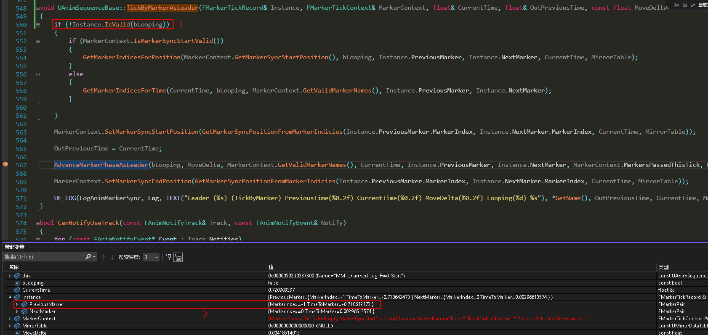
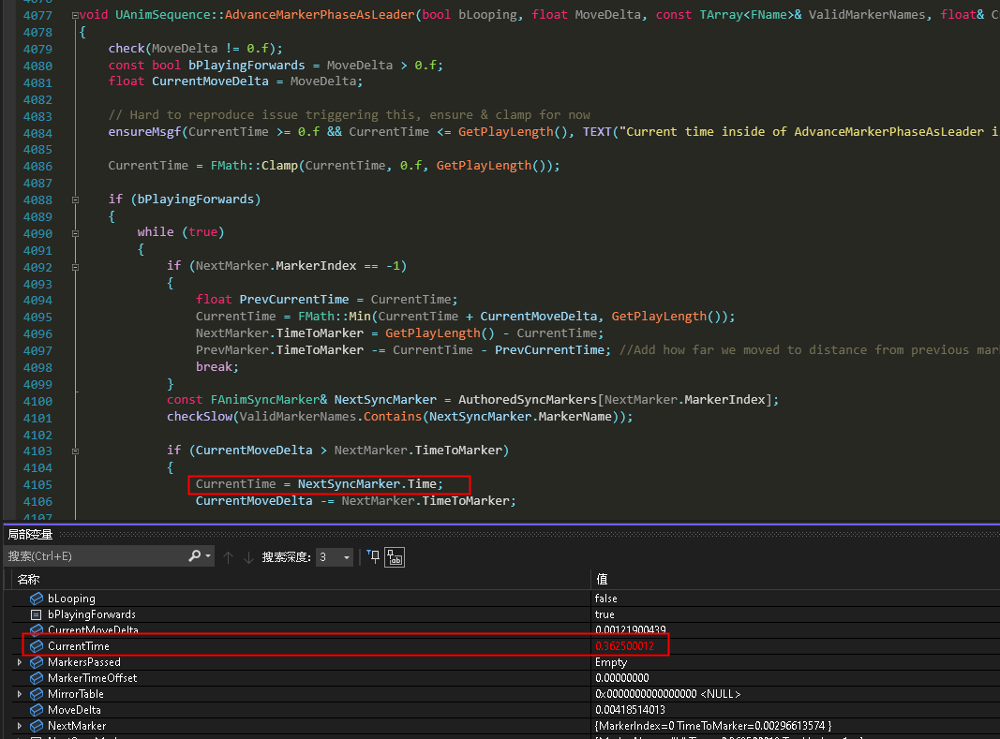

# Bug

Advance markers into wrong phase if not update the leader sync markers' index of non-looping sequence on the first phase leaving boundary

# Reproduce

See the [debugging process](Debugging_process.avi) video

- Range 0.00 to 14.16 seconds in the video, the start sequence is advanced normally at time 0.72s
- Range 14.18 to 18.14 seconds in the video, the start sequence is advanced at time 0.36s and this is the very next frame in the game.
- Range 18.15 to end seconds in the video, the start sequence then is advanced normally from time 0.72s

The bug is that the advanced time pops from 0.72s to 0.36s

# Cause

0.36s is about the time of the entering boundary of the first phase of "L" and "R" in start sequence.

Because start sequence is non-looping and the previous marker is not valid until it advance to "L" marker time, this is why the popped created.

# Solution

Update the previous marker by the ticking time, so it will in the correct phase when syncing.

# Details

Here is the buggy frame debugging details with figures and description.

See the "red square 1", it is always not be true for start sequence

See the "red square 2", the ticking previous marker is invalid, and it is close to the authored marker time of 0.36s.

In UAnimSequence::AdvanceMarkerPhaseAsLeader, CurrentTime will be set to the authored marker time because the marker is ticked close enough to it, then the pop created.

# Test

The fixed delta time based test is implemented in [ActorComponent.cpp](ActorComponent.cpp)

Review the whole test pipeline if needed by searching keyword "TestBegin" in this cpp file